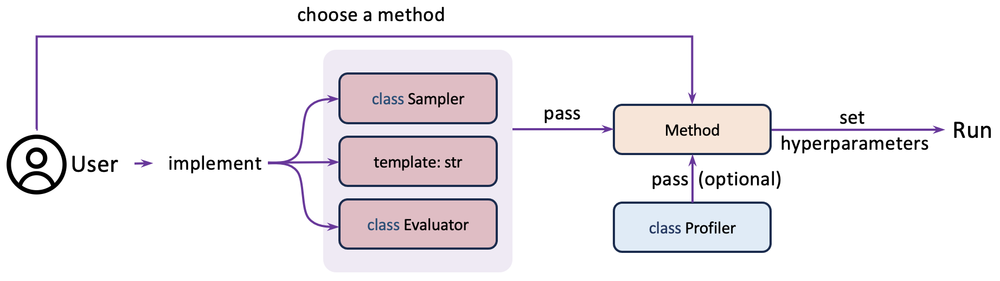

Run your algorithm design task
===============================

This tutorial will demonstrate a basic LLM4AD pipeline to solve an automated algorithm design task. The pipline is demonstrated in the following figure.

1. Prepare a `Sampler`
-----------------------

.. tip::
    If you want to deploy your own LLM or specify the way to interact with LLMs, please see :doc:`llm` for reference. This tutorial only demonstrates using OpenAI api.

Prepare an 'api_key' and specify the LLM model to be used. Please note that the 'base_url', 'api_key', 'model' arguments are required.

.. code:: python

    import llm4ad
    from llm4ad.tools.llm.llm_api_openai import OpenAI

    sampler = OpenAI(
        base_url='a.b.c',
        api_key='sk-abcwldfjlwhf23rwiduf2ienfeijo23f0isdhfnkwn',
        model='gpt-4o',
        timeout=30
    )

2. Prepare a template program
-------------------------------

.. note::
    The template program is the initial point of algorithm optimization. Please carefully design a template program and spend enough time on it!

The following information is suggested to be considered and addressed in your template program:

- Import all packages that will be used or those that are potentially used in future optimization processes.

- You can also define global variables and classes that may be useful in your template program (if necessary).

- An intuitive function name.

- The type of each argument (labeled by type-hint).

- The return value of the function.

- A brief yet detailed docstring about each argument and the return value.

.. important::
    Please note that the template program should be executable for all methods and should be valid/feasible/legal for methods except EoH.

Assuming that we are going to solve the Online Bin Packing problem, an example template program is shown below:

.. code:: python

    template = '''
    import numpy as np

    def priority(item: float, bins: np.ndarray) -> np.ndarray:
        """Returns priority with which we want to add item to each bin.
        Args:
            item: Size of item to be added to the bin.
            bins: Array of capacities for each bin.
        Return:
            Array of same size as bins with priority score of each bin.
        """
        return bins - item
    '''

3. Prepare an `Evaluator`
-------------------------

.. note::
    The `Evaluator` class determines how to assess the score of a given algorithm under specific settings and tasks, which is typically task-dependent. Therefore, we may design a new `Evaluator` for a specified problem. The Evaluator class (an abstract class) is a user interface. We should define a child class of `Evaluator` (which extends the `Evaluator` class).

Initialization of the Evaluator class
~~~~~~~~~~~~~~~~~~~~~~~~~~~~~~~~~~~~~~~~~~~~~~~~~~~~

By passing the respective argument to the Evaluator, the user can specify whether to use numba acceleration, protected division, or timeout seconds for code execution. Details about all arguments can be found in the base_package/evaluate section of this doc.

Implementation of the evaluate_program function
~~~~~~~~~~~~~~~~~~~~~~~~~~~~~~~~~~~~~~~~~~~~~~~~~~~~

The user should override the `evaluate_program` function in the Evaluator class (where the `evaluate_program` function remains unimplemented). The evaluate_program function evaluates the algorithm and gives a score. If you think the algorithm is infeasible/invalid/illegal, the user should return `None`. Otherwise, an int/float value or a "comparable" value (which may implement `>` operator between them) is desired.

.. important::
    If you think the algorithm to be evaluated is infeasible/invalid/illegal, the user should return `None`. Otherwise, an int/float value or a "comparable" value (which may implement `>` operator between them) is desired.

.. tip::
    Here you don't have to concern the evaluation time, as we will terminate the evaluation automatically in the backend if you have set `timeout_second` parameter.

The first argument of the function is a `program_str`, which is a `str` type of the algorithm to be evaluated. If you set the `use_numba_accelerate` or similar settings to `True` in the initialization, you will obtain a `str` typed function that has been modified. This `str` is provided to let you:

- Compile and execute the code with your own requirements.

- Consider the length or other features of the code.

- Other usages such as calculating the "novelty" of the code or checking if the code has been evaluated before.

The second argument of the function is a `callable_func`, which is an executable object. You can simply call (invoke) it by passing arguments to `callable_func`, such as `callable_function(arg0, arg1)`.

Feel free to use the platform-provided evaluator for the Online Bin Packing problem.

.. code:: python

    import llm4ad
    evaluator = llm4ad.problem.online_bin_packing.OBPEvaluator()

4. Specify a profiler and a logger (if necessary)
-------------------------------------------------

The profiler and logger will log your experiment locally/online for the convenience of monitoring, comparing, and summarizing your experiments.

.. note::
    Please note the type of the profiler may depend on the method you use. Assuming that we are using EoH.

.. code:: python

    from llm4ad.method.eoh.profiler import EoHWandbProfiler

    profiler = EoHWandbProfiler(wandb_project_name='obp',
                                log_dir='./logs/eoh_obp',
                                name='eoh_run1',
                                group='eoh')

5. Set parallel parameters and run.
------------------------------------

Pass above argument to EoH and run.

.. note::
    The `num_samplers` refers to the number of threads in that may access to the LLM simultaneously. The `num_evaluators` refers to the size of process execute pool, indicating the maximum processes used during evaluation (we may evaluate multiple algorithms in the same time).

.. caution::
    We use multi-threading for sampler, and multi-processing for evaluator. This means that we are using multi-core CPU during evaluation. Please kindly set these parameters to ensure safety.

.. code:: python

    from llm4ad.method.eoh import EoH

    eoh = EoH(
        template_program=template,
        sampler=sampler,
        profiler=profiler,
        evaluator=evaluator,
        max_sample_nums=1000,
        num_samplers=4,
        num_evaluators=4
    )
    eoh.run()
