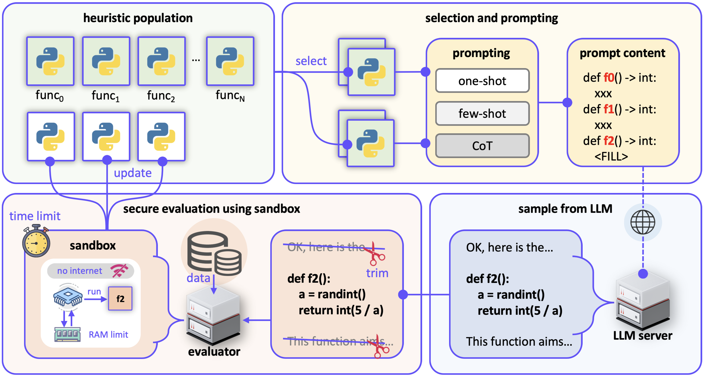

Welcome to LLM4AD Docs!
=======================

**Large language model for algorithm design (LLM4AD) platform** has established an efficient, large language model-based framework for algorithm design,
aimed at assisting researchers and related users in this field to conduct experimental exploration and industrial applications more quickly and conveniently.

🔥News
--------
- **Nov 5th, 2024:** LLM4AD 1.0.0 is released.

🚀Comming soon
---------------
- Other programming languages support.

🌟Features
------------
- LLM4AD unifies interfaces for multiple methods.
- Evaluation acceleration: multiprocessing evaluation, add numba wrapper for algorithms.
- Secure evaluation: main process protection, timeout interruption.
- Log and profiling: Wandb and Tensorboard support.
- Resume run supported.
- LLM4AD provides package for code modification and secure evaluation for future development.
- LLM4AD is with GUI support.

📦Supported methods
-----------------------
LLM4AD implements state-of-the-art large language model based algorithm design methods.

+-------------------------------------------------------+------------------------------------------------------------------------------------------------------------------------------+
| Methods                                               | Paper title                                                                                                                  |
+=======================================================+==============================================================================================================================+
| EoH💡                                                 | - Evolution of Heuristics: Towards Efficient Automatic Algorithm Design Using Large Language Model (ICML 2024)               |
|                                                       | - Algorithm Evolution Using Large Language Model (ArXiv 2023, AEL, the early version of EoH)                                 |
+-------------------------------------------------------+------------------------------------------------------------------------------------------------------------------------------+
| MEoH                                                  | - Multi-objective Evolution of Heuristic Using Large Language Model (AAAI 25)                                                |
+-------------------------------------------------------+------------------------------------------------------------------------------------------------------------------------------+
| FunSearch                                             | - Mathematical Discoveries from Program Search with Large Language Models (Nature 2024)                                      |
+-------------------------------------------------------+------------------------------------------------------------------------------------------------------------------------------+
| (1+1)-EPS (HillClimbing)💡                            | - Understanding the Importance of Evolutionary Search in Automated Heuristic Design with Large Language Models (PPSN 2024)   |
+-------------------------------------------------------+------------------------------------------------------------------------------------------------------------------------------+
| RandomSampling                                        | ----                                                                                                                         |
+-------------------------------------------------------+------------------------------------------------------------------------------------------------------------------------------+

.. note::
    💡: The implementation has some minor differences from the original method (demonstrated in their original paper), considering generality and multithreading acceleration.

.. tip::
    We also provide LLM-free examples to help understanding/building the pipeline of these methods!

🚌Supported tasks
----------------------
LLM4AD provides various example tasks including machine learning, optimization, and science discovery.

+-------------------------------------------------------+--------------------------------------------------------------------------------------------------------------------------+
| Domain                                                | Tasks                                                                                                                    |
+=======================================================+==========================================================================================================================+
| Machine learning                                      | Acrobot, Cart Pole, Mountain Var                                                                                         |
+-------------------------------------------------------+--------------------------------------------------------------------------------------------------------------------------+
| Optimization                                          | CVRP, OVRP, TSP, VRPTW                                                                                                   |
+-------------------------------------------------------+--------------------------------------------------------------------------------------------------------------------------+
| Science discovery                                     | Bacteria Grow, Ordinary Differential Equation, Oscillator 1, Oscillator 2, Stress Strain                                 |
+-------------------------------------------------------+--------------------------------------------------------------------------------------------------------------------------+

📝About LLM4AD
--------------------------

This platform is developed and maintained by LLM4AD developer group from the City University of Hong Kong (CityUHK) and the Southern University of Science and Technology (SUSTech). We develop LLM4AD platform for research purposes and hope to contribute to the research area by delivering tools for LLM-based algorithm design methods.

- **Contribution:** We are more than welcome to contribute including developing code and ideas to improve our platform. We are appriciated if you could give us a 🌟 on `GitHub <https://github.com/Optima-CityU/llm4ad>`_.

- **Collaborations:** If you like our platform, and you would like to use it for profit-making purposes? We are always searching for industrial collaborations because they help direct research to meet the industry’s needs.

- **Issue:** If you find a bug or you have any kind of concern regarding the correctness, please report us an issue.

- **Profit Purpose:** If you intend to use LLM4AD for any profit-making purposes, please contact `us <https://www.llm4ad.com/contact.html>`_.

🧭Navigation
------------

.. toctree::
    :maxdepth: 1
    :caption: Getting Started

    getting_started/installation
    getting_started/examples
    getting_started/online_demo
    getting_started/gui

.. toctree::
    :maxdepth: 1
    :caption: Developer Documentation

    dev/platform_structure
    dev/base/index
    dev/base_tutorial/index
    dev/run_new_task
    dev/llm

.. toctree::
    :maxdepth: 1
    :caption: Method

    method/eoh
    method/funsearch
    method/hillclimb
    method/randsample

.. toctree::
    :maxdepth: 1
    :caption: Task

    task/machine_learning/index
    task/optimization/index
    task/science_discovery/index
